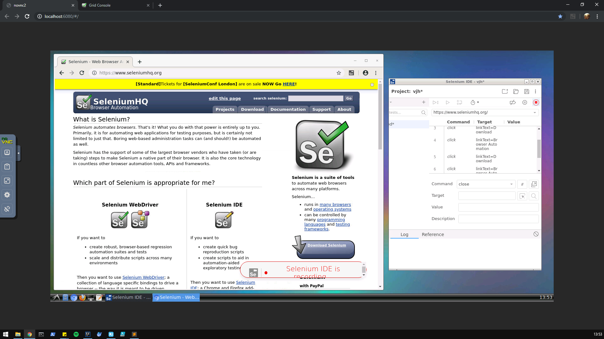

# Ubulenium

Maven project for recording and running Selenium tests in an isolated environment.



### Java project
Java  
Maven  
Springboot  
JUnit  

*Uses a customized docker container (Ubulenium)*

### Docker container

You can find the image [here](http://registrysf.sm2baleares.es/)

**Ubuntu** Desktop 18.04.2 LTS 64-bit  
**Chromium** 73.0  
**Firefox** 66.0.3  
**Selenium IDE** (for recording tests)  
**Selenium Server** 3.141.59 + Grid + Node (for running tests)  
**VNC Server** (Graphical interface)  

Ubuntu credentials: *user*, *password*

There are some directories mapped from the project to the container.  

| Host | Container |
| ---- | --------- |
| \src\main\resources\static\docker\mapped\Selenium | /home/user/Selenium |  

There are also some ports mapped from the container to your host.

| Host | Container | Use        |
| ---- | --------- | ---------- |
| 6080 |    80     | VNC Server |
| 6081 |   4444    |  Selenium  |
| 6082 |   8080    | Springboot static resources |

#### Make changes to the container
You may want to modify the image, you can do it by:
* Running the container
* Modifying whatever you need from ubuntu
* Commit container changes
````
docker commit <CONTAINER ID> registrysf.sm2baleares.es:5000/ubuntu-selenium:<vx>
````

>'CONTAINER ID' is not the IMAGE ID.  
'vx' is the version tag, where **x** is **n+1** being **n** the latest version available at that moment.  

* Push changes to the repository 
````
docker push registrysf.sm2baleares.es:5000/ubuntu-selenium:<vx>
````

> Always push the image with a new version tag, otherwise the image will be overwritten

## Getting Started

Clone the project
```
    git clone https://gitbucket.sm2baleares.es/git/jordi.ripoll/selenium.git
    cd .\selenium\
    git checkout <DESIRED BRANCH>
```

### Prerequisites

* [**Java**](https://www.java.com) 8 or higher
* [**Maven**](https://maven.apache.org) to run the project
* [**Docker**](https://www.docker.com/products/docker-desktop) to run the container
* [**Kitematic**](https://kitematic.com) for managing Docker containers (optional)

Check that you have everything installed  
```
    java -version
    mvn --version
    docker --version
```

### Installing

No need to install anything, just run the project with Maven.  
````
    mvn clean install
````
> Docker may ask you permission to share drives because of the mapped directories.

You may want to skip tests to run them manually
````
    mvn clean install -DskipTests
````
> You can always right click the test class and 'Run <TEST_CLASS_NAME>'

Check that the container is up and running  
* [Here](http://127.0.0.1:6080) you should see the Ubuntu desktop.   
* [Here](http://127.0.0.1:6081/grid/console) you should see a Selenium Grid Console and a node with Chrome and Firefox.  

> **Note**: Your IP may be different.

## Usage
Once the project has finished installing the Docker container you can begin to record and run tests.

### Record tests

1. Open *http://127.0.0.1:6080* with your browser  

> You are now inside the container  

2. Open Chromium from the task bar  

> You will see that it has Selenium IDE installed  

3. Open Selenium IDE extension  
4. Record the test  
5. Export it to one of the [mapped directories](#docker-container)  

> You now have it on your host machine in the mapped directory you saved it to.  
> Remember that containers are not virtual machines, its storage is volatile so save all data you don't want to be 
erased, always save files in one of the mapped directories.  
> **Note**: Docker may have some temporary files but save what you want to keep.

### Run tests
You need to start the Selenium server inside the container, simply by opening the two scripts in the ubuntu Desktop in this order:  

1. start_hub.sh  
2. start_node.sh  

> To stop the server close the two terminal windows.

> You can start as many nodes as you want, running the *start_node.sh* script more times.

You can run tests via a *RemoteWebDriver* from the Java project, inside **/src/test/java** create a new package and a class 
that extends the *Common* class, where the *Webdriver* is initialized.  
The new class will override the *@Test* method and has to have this structure:

````java
    package your_package_name;
    
    import all.Common;
    import org.junit.Test;
    import org.openqa.selenium.*;
    
    public class your_class_name extends Common {
        @Test
        public void test_name() {
            //Your test goes here
        }
    }
````

Now you just have to run the project to run all tests or Run a specific test running the Java class.  

The Common.java class contains the @Before and @After methods, in the @Before you can choose how to execute the tests:
* **Local Chrome** (Host machine)
* **Remote Chrome** (Docker Container)
* **Local Firefox** (Host machine)
* **Remote Firefox** (Docker container)

Simply uncomment the driver declaration you want to use.  

### Remove docker images and containers of this project
**Be careful! This three commands will stop the container, remove it and delete it's image!**
````
    docker stop (docker ps -aqf "name=ubulenium");
    docker rm (docker ps -aqf "name=ubulenium");
    docker rmi $( docker images --format "{{.Repository}}:{{.Tag}}"|findstr "ubuntu-selenium" )
````

## Built With

* [**Maven**](https://maven.apache.org/) - Dependency Management
* [**Spring**](https://spring.io/) - Java framework
* [**Spring Boot**](https://spring.io/projects/spring-boot) - Spring extension
